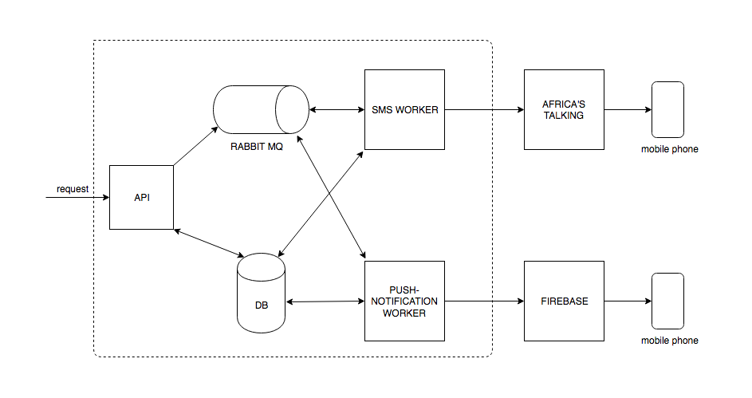

# pycon-monitoring-workshop
[](https://app.codacy.com/app/kwahome/pycon-monitoring-workshop?utm_source=github.com&utm_medium=referral&utm_content=kwahome/pycon-monitoring-workshop&utm_campaign=Badge_Grade_Dashboard)
[](https://travis-ci.com/kwahome/pycon-monitoring-workshop)
[](https://codecov.io/gh/kwahome/pycon-monitoring-workshop)
[](https://github.com/ambv/black)

### Brief
Reliability and stability of your services is highly dependent on understanding the state of your infrastructure and systems. Troubleshooting them effectively necessitates real-time performance, data presented at fine granularity.

One of the best ways to gain this insight is with a robust monitoring system that gathers metrics, visualizes data, and alerts operators when things appear to be broken.

Metrics, monitoring, and alerting are thus interleaved concepts that together form the basis of a monitoring system. They have the ability to provide visibility into the health of your systems, help you understand trends in usage or behavior, and to understand the impact of changes you make. If the metrics fall outside of your expected ranges or thresholds, these systems can send notifications to prompt an operator to take a look, and can then assist in surfacing information to help identify the possible causes.

### Objectives:

- Reasons for a monitoring system
- Historical challenges to effective monitoring
- Monitoring Strategy: Choosing what and where to monitor
- Important qualities of a Metrics, Monitoring, and Alerting System
- Designing/architecting applications for monitoring & observability

## Messaging/Notification Service
To adequately demonstrate implementation of a monitoring system in a Python application/service, a messaging service has been built.

The service is designed to handle messages of varying kind (push, SMS).

A sample payload to the notifications endpoint:

```
{
  "messageId": "y7sdxl24df",
  "senderId": "0700123456",
  "recipients": [
    "0700987654"
  ],
  "messageType": "dummy",
  "channel": "africas-talking",
  "message": "This is an example message",
  "priority": "normal",
  "callback": "https://mydomain.com/callback/y7sdxl24df"
}
```

The API is also documented in a [swagger doc](https://github.com/kwahome/pycon-monitoring-workshop/blob/master/docs/api/swagger/send-message-1.0.yml) which can be rendered via a swagger ui available on `localhost` port `9001`

Below are the overall architectural and sequence diagrams:

###### 1. Architectural overview



###### 2. Sequence diagram


## Getting Started

These instructions will get you a copy of the project up and running on your local machine for development and testing purposes.

#### Prerequisites

For your local development environment, you will need the following installed:

- docker
- docker-compose

Follow instructions in this [link](https://docs.docker.com/install/) for a guide on installing docker and docker-compose

#### Cloning & set up pre-commit hook

- Clone the repository and navigate to the project root
- Set up pre-commit hook by running this command from the project root

```
pip install flake8 && cp devops/scripts/commit-checks.sh .git/hooks/pre-commit
```

#### Start the app

Run `docker-compose up` to fire up the notification service app & critical dependencies (database, rabbitmq, redis)

Hit this url http://localhost:80/ to access the app. This will send a request to the nginx LB that in turn proxies it to the web server backends.

- Run `docker ps -a` to see all docker containers running on your development machine:

- To access your running container bash, run `docker exec -it <CONTAINER-ID> bash`. This will launch you into the container

- Do the same for the database container if you need to access it.

#### Running Tests

To run local tests, run

```
docker-compose run app ./devops/scripts/run_test.sh
```

Coverage reports will be written to htmlcov/index.html

## Contributing
Please read [CONTRIBUTING.md](https://github.com/kwahome/pycon-monitoring-workshop/blob/master/CONTRIBUTING.md) for details on our code of conduct, and the process for submitting pull requests to us.

## Versioning
We use [SemVer](https://semver.org/) for versioning. For the versions available, see the tags on this repository.

## License
This software is licensed under the MIT License. See the [LICENSE](https://github.com/kwahome/pycon-monitoring-workshop/blob/master/LICENSE) file in the top distribution directory for the full license text.
